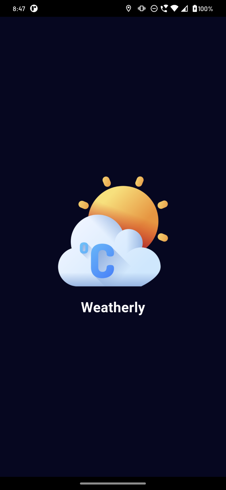
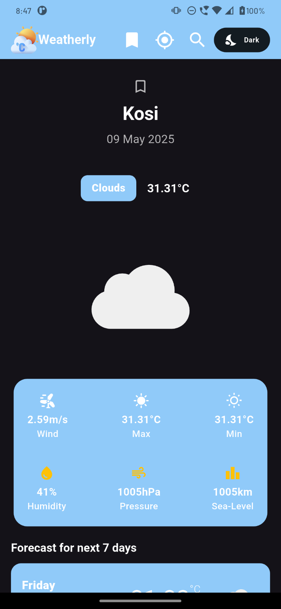
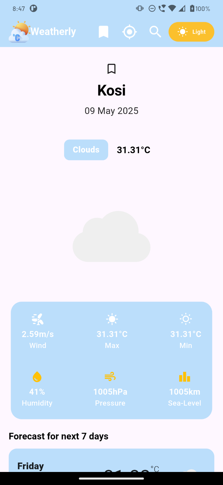
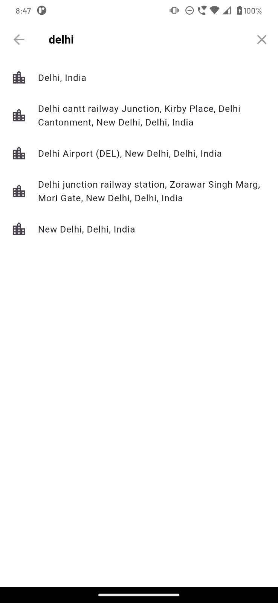
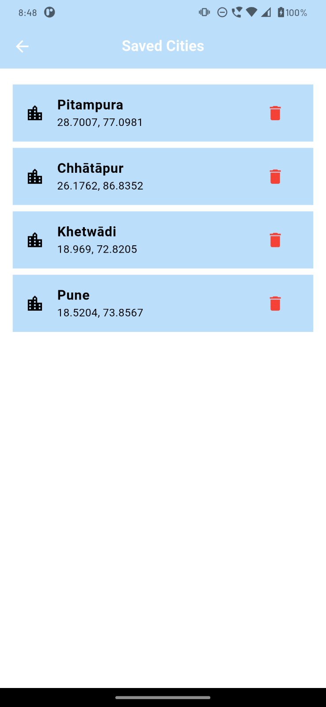
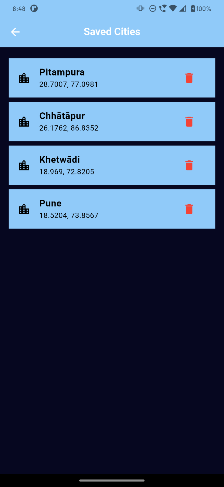
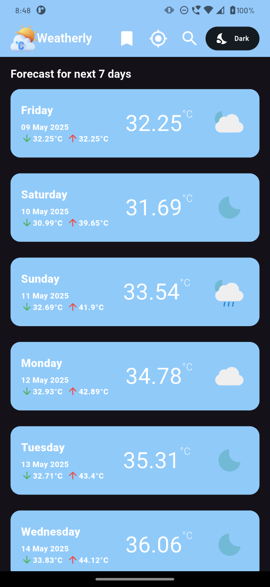

# Weatherly - Flutter Weather Application

## App Demo









Welcome to **Weatherly**, a weather forecasting mobile application built using **Flutter**. This app is designed with a clean architecture and a feature-first approach to provide an easy-to-maintain and scalable structure.

## Table of Contents

1. [Project Overview](#project-overview)
2. [Tech Stack](#tech-stack)
3. [Features](#features)
4. [Getting Started](#getting-started)
5. [Environment Setup](#environment-setup)
6. [State Management](#state-management)
7. [License](#license)

## Project Overview

**Weatherly** provides accurate weather forecasts based on location. The app fetches weather data from an API and presents it in a user-friendly interface. Weatherly is built with an emphasis on **clean architecture** and **modularity**. It follows the **feature-first approach** for better maintainability and scalability.

## Tech Stack

- **Flutter**: The cross-platform framework used to build the app.
- **Dart**: The programming language used for development.
- **Riverpod**: State management library for managing app state in a scalable and efficient way.
- **Clean Architecture**: Ensures a clear separation of concerns and promotes better testability and maintainability.
- **JSON**: For environment configuration and API settings.
- **HTTP**: To make network requests for weather data.

## Features

- **Current Weather**: Get real-time weather data based on the user's location.
- **Forecast**: View weather forecasts for the next few days.
- **Location-based Weather**: Automatically fetch the user's location to provide weather updates.
- **Search**: Search weather data for different cities or locations.
- **Beautiful UI**: A clean and easy-to-use interface to provide a seamless user experience.

## Getting Started

To get started with Weatherly, follow these steps:

### 1. Clone the repository:
```bash
git clone https://github.com/RohitIdeaUsher/Weatherly.git
```

### 2. Install dependencies:
Navigate to the project folder and install the required dependencies.
```bash
cd weatherly
flutter pub get
```

### 3. Configure your environment:
You need to set up your API keys and environment variables.

- Create a file called `env.json` in the project directory.
- Add your API keys and other configurations inside `env.json`.

Example of `env.json`:
```json
{
  "api_key": "YOUR_API_KEY",
  "base_url": "https://api.openweathermap.org/data/2.5/"
}
```

### 4. Run the app:
After setting up the environment, you can run the app on an emulator or physical device:
```bash
flutter run
```

## Environment Setup

To set up your environment, create a `env.json` file inside the `assets/` directory. The `env.json` file contains sensitive information like API keys and base URLs.

### Example `env.json`:
```json
{
  "API_KEY": "YOUR_API_KEY_HERE",
  "PLACE_KEY": "YOUR_API_KEY_HERE"
}
```

---

## Project Directory Structure

```
lib/
├── components/              # Reusable widgets (e.g., theme toggle, save button)
├── core/                    # Theme, utilities, and global services
├── features/                # Feature-first structure
│   ├── dashboard/           # Home weather screen, search, forecast
│   ├── saved_city/          # Saved cities logic and UI
│   └── splash/              # Initial splash logic and UI
├── services/                # Local DB and API clients
└── main.dart                # App entry point
```

---

## State Management

**Riverpod** is used for state management throughout the app. Riverpod provides a modern and scalable way to manage and share state between different parts of the application.

---

## License

MIT License.  
Feel free to use, fork, or improve!

---
